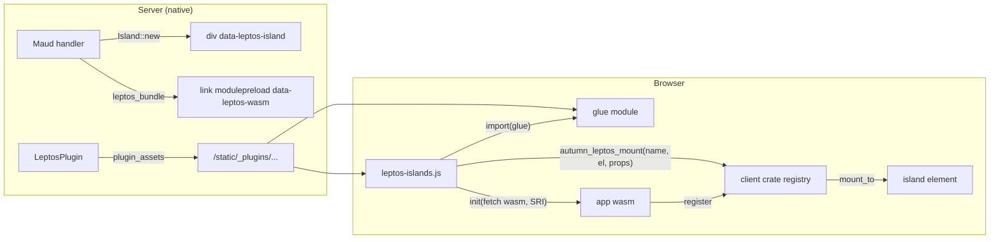

# ADR 0001: Leptos islands with a JS loader and a wasm ABI

Status: accepted. Date: 2026-10-07.

## Context

Autumn pages are Maud + htmx. An app wants some Leptos components in
those pages. Leptos compiles to wasm with wasm-bindgen. Maud owns the page,
so Leptos cannot render the full page. The React and Svelte plugins solve
the same problem for JavaScript frameworks with a loader and a queue.

## Decision

1. **Two crates.** `autumn-plugin-leptos` is the server crate. It serves
   the loader and the app bundles, and renders tags and islands.
   `autumn-plugin-leptos-client` is the wasm crate. The app calls
   `register` in its `#[wasm_bindgen(start)]` function.
2. **One JS loader, many bundles.** The loader finds each
   `link[data-leptos-wasm]`. It imports the glue module and calls `init`
   with an SRI-checked `fetch` of the `.wasm`.
3. **A versioned ABI.** The client crate exports `autumn_leptos_abi`
   (version 1), `autumn_leptos_start`, `autumn_leptos_mount` and the
   `LeptosIsland` handle. The loader refuses other versions.
4. **CSR mount.** `mount_to` renders the component into the island
   element. The loader keeps the fallback nodes and puts them back at
   teardown.
5. **Reactive props.** The component gets `Signal
`. `update` sets the
   signal, so the component keeps its state.
6. **Panic guard.** A Rust panic stops the wasm instance. The client
   panic hook sends `autumn:leptos:panic`. The loader marks the bundle as
   crashed and puts the fallbacks back without a call into wasm.
7. **CSP.** Only the config loader can change the CSP. An app has one
   loader, so the plugin does not replace it. The app opts in with
   `WasmCspLoader`, or puts `wasm_csp()` in
   `security.headers.content_security_policy`.
8. **SSR fallback (`ssr` feature).** `Island::fallback_view` renders a
   Leptos view to HTML on the server. The client replaces it at mount.

## Alternatives

- **Hydration (`hydrate_from`).** Deferred. The `hydrate` feature changes
  the renderer for the full client build. A markup mismatch panics and
  stops the bundle.
- **Leptos islands mode.** Rejected. Leptos must render the full page.
- **A loader in Rust.** Rejected. Each bundle would get its own observer.
  A JS loader shows fallbacks also when wasm cannot load.
- **A JS queue as in the React plugin.** Rejected. The app would write
  JavaScript glue. The ABI exports need no app JavaScript.

## Consequences

- The app needs a wasm toolchain at build time: `wasm32-unknown-unknown`
  and `wasm-bindgen-cli` with the lockfile version.
- The app sets a CSP with `'wasm-unsafe-eval'`.
- A panic affects all islands of one bundle. Split bundles to isolate
  them.
- A change to the ABI, the attribute names or the events is a breaking
  change.
